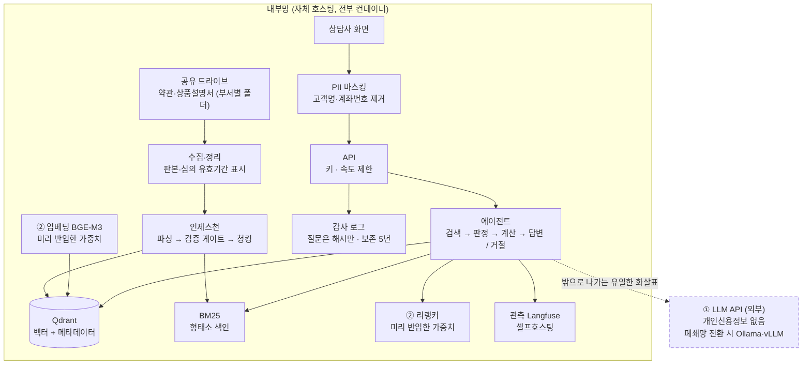

# 서비스 아키텍처 (예시) — 한빛저축은행 준폐쇄망

> 강사가 만든 예시입니다. 인터뷰에서 나온 제약(GPU 없음, 공유 드라이브, 상담 이력의 개인정보, 감사 대응, 반입 분기 1회)을 그림에 넣었습니다.
> 이 그림에서 볼 것은 둘뿐입니다. **밖으로 나가는 화살표가 하나**라는 것과, 완전 폐쇄망으로 갈 때 **바꾸는 곳이 ①②③ 세 곳**이라는 것.

## 그림 (텍스트판)

```
 ┌─ 내부망 (전부 컨테이너, CPU 로 돈다) ─────────────────────────────────────┐
 │                                                                            │
 │  공유 드라이브 ──▶ 수집·정리 ──▶ 인제스천 ──▶ 벡터DB (Qdrant)              │
 │  (약관·설명서)   (판본·만료 표시)  (파싱→검증→청킹)    │                    │
 │                                                 ┌─────┴─────┐              │
 │  상담사 화면 ──▶ PII 마스킹 ──▶ API ──▶ 에이전트 ──▶ 검색 ─▶ 리랭커         │
 │                  (고객명·계좌)   │         │  (거절·재검색·계산)             │
 │                                 │         │                                │
 │                             감사 로그    관측 (Langfuse)                    │
 │                             (질문은 해시, 보존 5년)                         │
 │                                           │                                │
 │  ② 임베딩·리랭커 가중치: 미리 반입해 둔 것 사용                             │
 │  ③ 컨테이너 이미지: 사내 레지스트리에서                                     │
 └───────────────────────────────────────────┼────────────────────────────────┘
                                             │  ← 밖으로 나가는 유일한 화살표
                                             ▼
                                   ① LLM API (외부)
                                   개인신용정보 없음 · 조항 본문 + 질문만
                                   폐쇄망 전환 시 → 내부 Ollama/vLLM (GPU 필요)
```

## 그림 (mermaid) — mermaid.live 에 붙이면 그려집니다



③ 컨테이너 이미지는 그림에 박스로 그리지 않습니다. 모든 박스가 이미지이고, 폐쇄망에서는 그 이미지를 사내 레지스트리에서 받습니다.

## 밖으로 나가는 것

| 나가는 것 | 무엇이 담기나 | 안 담기게 하려면 |
|---|---|---|
| LLM API 호출 | 마스킹된 질문 + 검색된 조항 본문 | PII 마스킹이 API 앞에 있다. 상담 이력은 보내지 않는다 |

**한빛저축은행은 이 화살표를 허용하는가**: 조건부. 개인신용정보 미포함, 상담사 보조, 위원회 승인과 반기 이행평가.

## 완전 폐쇄망으로 갈 때 바꾸는 세 곳

| # | 지금 | 폐쇄망에서 | 바꾸는 방법 | 걸리는 시간 |
|---|---|---|---|---|
| ① | 외부 LLM API | 내부 Ollama·vLLM | 설정 파일의 모델 이름 한 줄 | GPU 품의 6개월 |
| ② | HuggingFace 에서 가중치 다운로드 | 미리 반입한 가중치 | `HF_HUB_OFFLINE=1` + 반입한 폴더 | 반입 창구 분기 1회 |
| ③ | Docker Hub 이미지 | 사내 레지스트리 | 이미지 주소 변경 | 반입 창구 분기 1회 |

나머지 박스는 이미 전부 내부에서 돕니다. 그래서 준폐쇄망입니다.

## 한빛 제약이 그림에 들어간 곳

| 인터뷰에서 나온 것 | 그림에서 |
|---|---|
| GPU 가 없다 | ① 을 외부 API 로 두고, 내부 LLM 은 "GPU 필요"로 표시 |
| 문서가 공유 드라이브에 흩어져 있고 관리자가 없다 | 인제스천 앞에 "수집·정리" 박스. 판본과 만료를 여기서 표시 |
| 질문에 고객 이름이 섞인다 | API 앞에 PII 마스킹 박스 |
| 감사에 답할 로그가 필요하다 | 감사 로그 박스. 질문 원문 대신 해시, 보존 기간 명시 |
| 반입은 분기 1회 | ②③ 에 시간을 적었다. PoC 일정보다 반입 신청이 먼저 |

## 고객사에서 이 그림을 보여 주면 받는 질문 세 개

**"뭐가 밖으로 나갑니까?"** 마스킹된 질문과 조항 본문뿐입니다. 고객 정보는 API 앞에서 지웁니다.

**"그 API 도 끊으면요?"** ① 만 내부 모델로 바꾸면 됩니다. 단, GPU 가 있어야 품질이 유지됩니다. 그래서 GPU 품의를 지금 검토해 달라고 말합니다.

**"로그에 고객 이름이 남지 않습니까?"** 감사 로그에는 질문의 해시만 남깁니다. 누가 언제 물었는지는 남고, 무엇을 물었는지 원문은 남지 않습니다.
